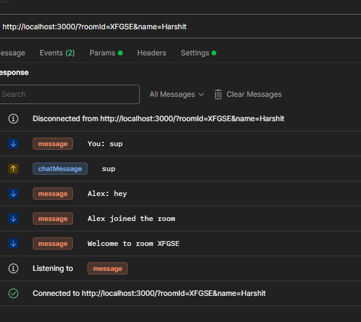
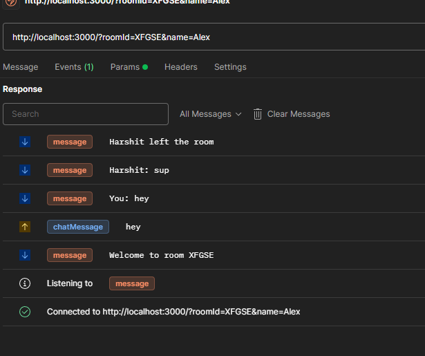

# SocketGame

A simple game using sockets in node.js. It is a simple server which enables to join users a room and communicate with each other.
 
Just now this is a simple chat room, but I am planning to add more features to it.
  Currently this is in WIP.It is a server only, so you will be communicating through the api. I will be adding a client soon.

## Images
- User 1 joins the room and creates a room

- User 2 joins the room

---
- Above images show chat between two users with system messages live events updates like user joined, user left etc.

## How to run

1. Clone the repository
2. Run `npm install`
3. Run `npm run dev`
4. Open your browser and go to `localhost:3000`

## How to use
(Will be updated soon) or you can check the code in the `src` folder.
You will be needing api tools like postman to communicate with the server.

## Features
- [x] Game room
- [x] Chat filtering
- [x] System messages
- [x] Ban users / Kick users
- [ ] Game
- [ ] User authentication

## Contributing
Feel free to contribute to this project. You can fork the project and make a pull request. I will be happy to review it.

## License
This project is licensed under the MIT License - see the [LICENSE.md](LICENSE.md) file for details

## Acknowledgments
- [Socket.io](https://socket.io/)
- [Node.js](https://nodejs.org/)
- [Express](https://expressjs.com/)

## Author
- [Harshit Katheria](https://github.com/UxHarshit)
